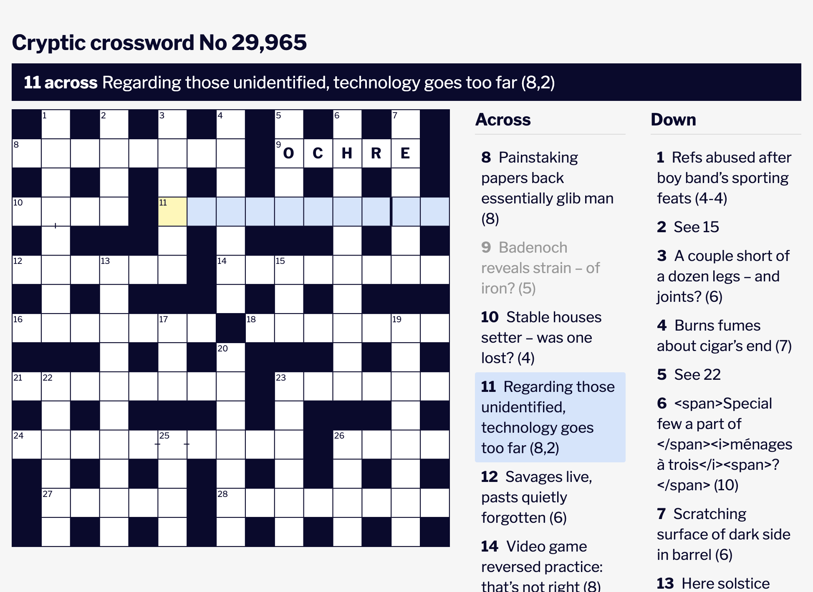

# Guardian Crossword

Simple locally-runnable webapp that provides a better interface - less noisy, less buggy and crash-free - for the Guardian crosswords. Also allows switching between NYT and Guardian navigation styles. Written in Elm.

More info [on my blog](https://whitebeard.blog/posts/building-a-better-crossword-page/).



## Prerequisites

- [Node.js](https://nodejs.org/)
- [Elm](https://guide.elm-lang.org/install/elm.html)

## Install

```sh
npm install
```

## Run

```sh
npx vite
```

Then open http://localhost:5173/ in your browser.

## Build

```sh
npx vite build
```
