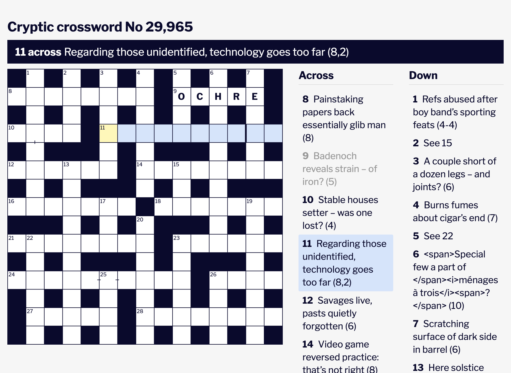

# Guardian Crossword

Simple locally-runnable webapp that provides a better interface - less noisy, less buggy and crash-free - for the Guardian crosswords. Also allows switching between NYT and Guardian navigation styles. Written in Elm.

More info [on my blog](https://whitebeard.blog/posts/building-a-better-crossword-page/).



## Prerequisites

- [Node.js](https://nodejs.org/)
- [Elm](https://guide.elm-lang.org/install/elm.html)

## Install

```sh
npm install
```

## Run

```sh
npx vite
```

Then open http://localhost:5173/ in your browser.

## Build

```sh
npx vite build
```

## Anagram finder

There's an anagram solver behind the **ARTS↔TSAR** button at the top right.
It uses a preprocessed copy of the [UK Advanced Cryptics
Dictionary](https://github.com/rdeits/cryptics/raw/refs/heads/master/raw_data/UKACD.txt)
(UKACD) by J Ross Beresford. The processed dictionary lives at
`public/dict.txt` — one word per line, alphabetical, nothing else — and is
committed to the repo; to regenerate it from source run:

```sh
npm run build-dict
```

The first run downloads UKACD into `scripts/ukacd.txt` (gitignored) and
preprocesses it; subsequent runs reuse the cached source.

The anagram keys — each word's letters, sorted — are derived in the browser
rather than shipped, because a key is only a permutation of the word it
indexes and storing both stores every word twice.

## Licenses

This project is released under the [MIT License](LICENSE).

UKACD is distributed under a 3-clause BSD-style license — see
[LICENSE-UKACD](LICENSE-UKACD).
